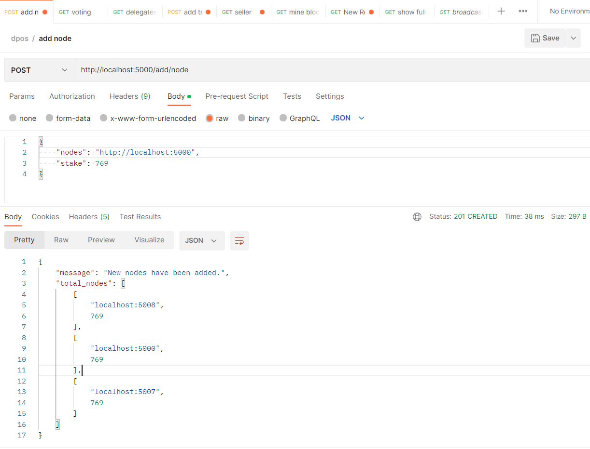
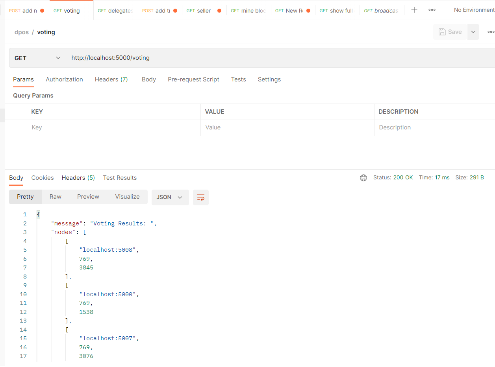
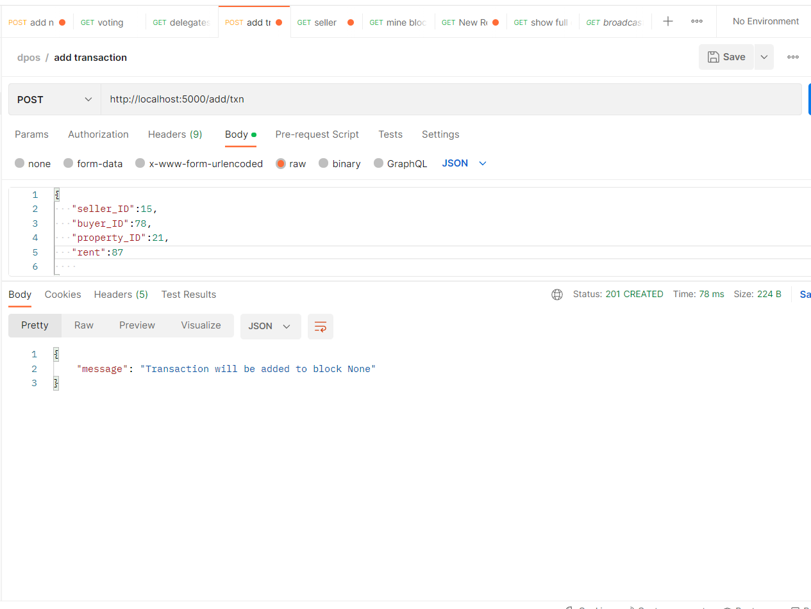
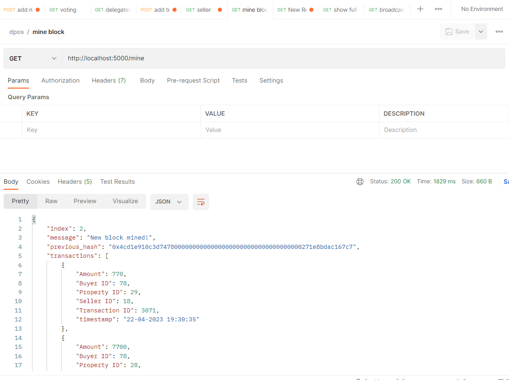
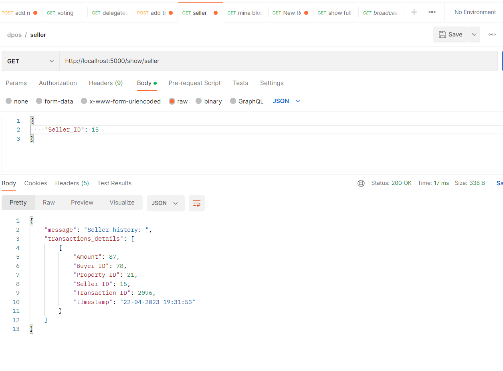
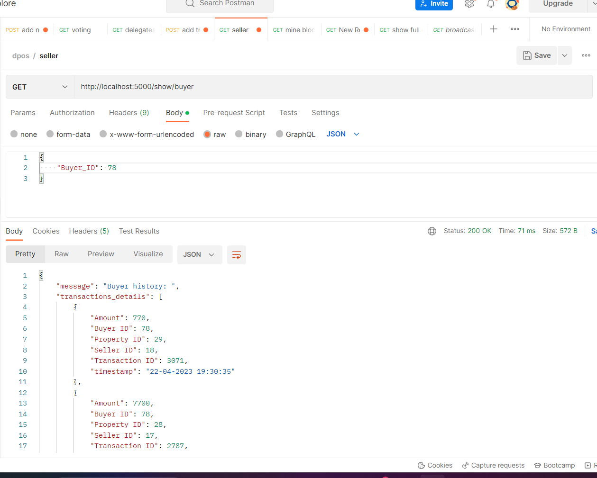

# Housing Rental Solutions:
In our assignment we have implemeted a housing rental solution using blockchain and cryptography. We have broadly implemented 3 major features including:
	1. Tenant Screeing 
	2. Payment Processing
	3. Property Management

We also have implemented zero knowledge proof for checking if the property is actually owned by the seller.

## Implementation:
##  bchain.py
### __init__:
Constructor defining all the lists and variables required for the blockchain network.

Intially the previous hash for the genesis block is defined as 0.

### add_block:

A block containing the transaction list in block data and merkle root, timestamp, index and previous hash in block header is added to the blockchain network.
The timestamp has date in ("%d/%m/%Y %H:%M:%S") format.		

### new_txn

Adds new transactions between two parties for a particular property using all the required attributes:
'Transaction ID'
'Buyer ID'
'Seller ID'
'Property ID'
'Amount'
'Time Stamp' (format:"%d-%m-%Y %H:%M:%S")

### validate_txn

The unverified transacitons are added to the verified transaction list during mining of the block. Zero knoweledge proof is implemented here.
### show_seller

List of transactions sorted by timestamp, corresponding to a particular SELLER_ID

### show_buyer

List of transactions sorted by timestamp, corresponding to a particular BUYER_ID

### calc_hash

Calculates hash value using SHA256 for hash of previous block as well as merkle root hash calculation.

### txn_history

Returns the history of transactions sorted by timestamp for a particular Property_ID

### voting_power

Multiplies the stake of each block with a random integer between 1 to 10 for the delegates who will mine the block into the blockchain.

### delegates_selection

Only 3 delegates are selected based on the voting results from the above function

### mine

The given block is mined and added into the blockchain.
THe unverified transactions are then verified and unverified transaction list is made empty.

### merkle_tree

Implemented by calculating final hash from all the transactions from the given block in the merkle root.
This is stored in the block header.

## largerprime.py
This part of the code adds the zeero-knowledge proofs to the blockchain where it checks if a seller has a property or not without knowing the property id before.
####  is_probably_prime(n, k=5):
Implements the Miller-Rabin primality test to check whether a given integer n is probably prime. 

#### generate_large_prime(bit_length):
The function first generates a random integer n with bit_length number of bits using the getrandbits function from the random module. 

#### gcd(a, b):
Finds the greatest common divisor of a and b.

#### is_primitive_root(g, p):
The is_primitive_root function tests whether a given integer g is a primitive root modulo a prime number p. It uses the fact that if g is a primitive root modulo p, then g^((p-1)/f) ≢ 1 (mod p) for every prime factor f of p-1.

#### find_generator( p ):
The find_generator function finds a generator for the given prime number p by testing random numbers until a primitive root is found. A primitive root g modulo p is an integer such that every integer modulo p is a power of g.

#### toret():
The toret function generates a large prime number and finds a generator for it, and then returns the generator.

Finally, the code tests the toret function by running it when the script is executed directly. 

## How to run the code:
    1. run the file main.py
    2. Open POSTMAN API and go to the add node request to add nodes which are basically miners.
        
        2.1. Min 3 nodes because of dpos. Here we need to input the nodes are correspoding stakes.
    3.Now we go to the voting route in Postman to select the node with the maximum stake.
    
    4. Then we move to the  delegates where we can see all the nodes selected in voting.
    5. Now we add transactions where we put seller ID, buyer ID, property ID and rent.
    
    6. Then we mine the block which is done by the miners of the selected delegates.
    
    7. Now we do the user filtering in accordance to the buyer ID and seller ID.
    
    
    8. Show of chain.
    
    

## Team Members:
    1. Ansh Gupta 2020A7PS0259H
    2. Ishaan Srivastava 2020A7PS2071H
    3. Sahil Bhore 2020A7PS2065H
    4. Gavhane Nikhil Eknath 2020A7PS1724H
    5. Uday Singh Thakur 2020A7PS2050H